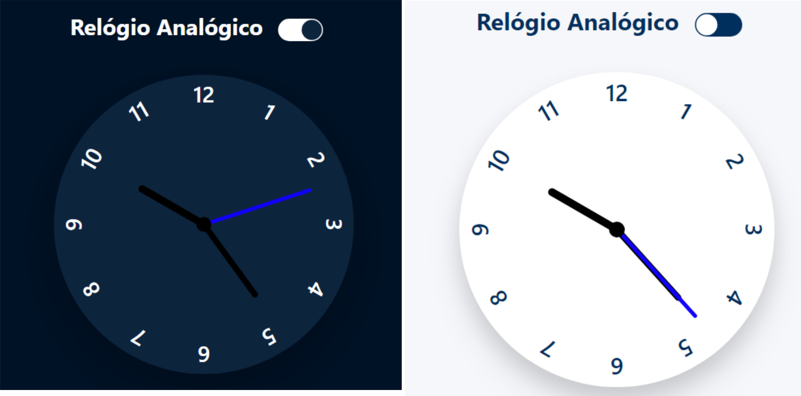

# Relógio Analógico

- Desenvolvimento de um relógio que mostra o horário exato, com opção de um botão dark e light mode na página. 

## Tecnologias

- HTML 5
- CSS 3
- JavaScript

## Visualização

